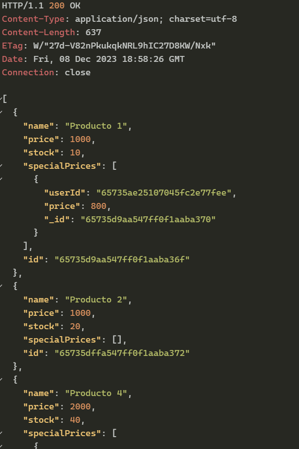
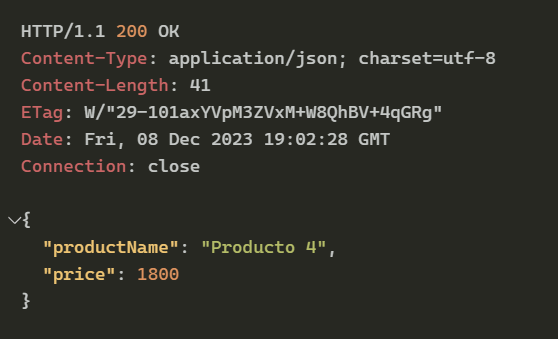

## API ZAPATILLAS

### DESCRIPCION
El problema implica crear una API usando Express para una tienda de zapatillas. Eres requerido
implementar dos rutas públicas:

### REQUERIMIENTOS Y CRITERIOS

1. /productos: esta ruta debe devolver una matriz que contenga solo los productos que son
Actualmente en stock.
2. /price/{user_id}/{nombre_producto}: Algunos clientes de este negocio tienen ofertas especiales
Precios para determinadas marcas. Esta ruta debería devolver el precio especial para el cliente dado y
marca, si está disponible. Si el cliente no tiene un precio especial para la marca, la ruta debe
devolver el precio base.

### ADICIONES

- Se agregó un par de rutas opcionales para realizar pruebas(no de testing) y poder llevar a cabo los requerimientos.
- Realice el ejercicio creando una colección nueva llamada con sus documentos Product y User para mongoDB.

### CONFIG.

- Crear un archivo .env que contenga dos variables
 PORT = 3001
 MONGODB_URI = "mongodb://drenvio:<password>@ac-aemgtkt-shard-00-00.unqyghm.mongodb.net:27017,ac-aemgtkt-shard-00-01.unqyghm.mongodb.net:27017,ac-aemgtkt-shard-00-02.unqyghm.mongodb.net:27017/sneaker-app?replicaSet=atlas-y8oxsk-shard-0&ssl=true&authSource=admin"

- Se podrá llevar a cabo el despliegue en HEROKU, pero ya no tengo una cuenta sandbox gratuita y he tenido problemas con esta, una de ellas es no borrar el repo y me ha ocasionado cobros necesarios.

- Se puede realizar una instalacion para desarrollo, clonando el repo y ejecutar
 npm install
 npm start (no se ejcuta en nodemon)

- Se puede probar la API desde POSTMAN o en su defecto con la extension REST CLIENT de VSCODE, en la raiz del proyecto ya esta configurado los endpoints en un archivo <app.http>

### ADDONS

- Realice sintaxis voluntarias y expuestas como visualizar variables de entornos y las colecciones de la base de datos con fines educativos y desarrollo.
- Se puede mejorar el aplicativo agregando middelware y cors para ser consumidos por terceros, no se requirió, pero realicé un handlers de tipo middleware para controlar los errores.

### SCREENSHOT

